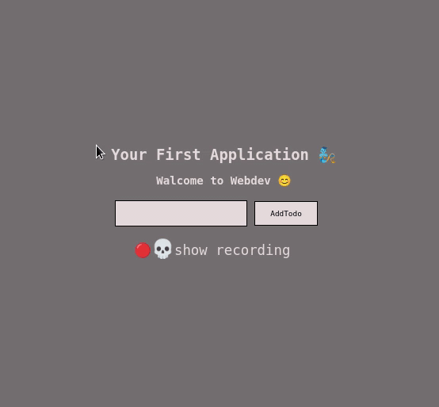

<div align="center">


[](https://github.com/DSDmark/TodoList/actions/workflows/pages/pages-build-deployment)

#  Your First Application 🤟
## Walcome to Webdev 😊

<div>

<div align="center">

<div align="left">

---

### How to install

1. Click on green **Clone or download** button and choose Download ZIP.
2. Find the downloaded zipped file on your pc and extract it.
3. Then install `nodejs` and `NPM` in your local system
4. Open Root Directory and install all dependences by that commend `npm install`,
5. Run commend.
> ```npm run start```

Once you are done  you can close the application in your terminal to quit the application.
dependences 
  
---

## Try Out TodoList Demo

<a href="https://dsdmark.github.io/TodoList/" alt="TodoList Demo">TodoList Demo</a>

</div>
dependences 
### Todo List



</div>

> If you have any issues with that Application feel free to let me know!

> If you are more interested, check out the collection of [ **CLIsapplications**](https://github.com/DSDmark/CLIsapplications"CLIsapplications").
---
